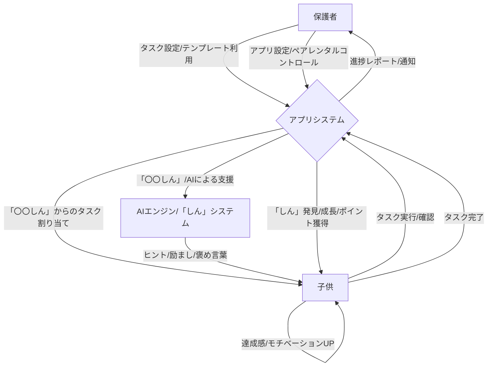
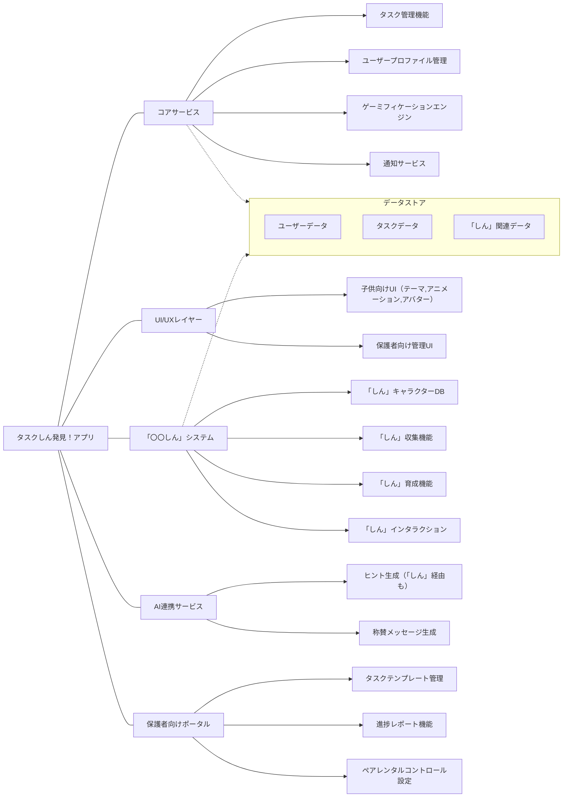

# 01 子供向けタスク管理アプリ「タスクしん発見！」 要件定義書

## 1. アプリ概要

「タスクしん発見！」は、お子様が日々のお勉強、お手伝い、お片付けなどのタスクを、まるで冒険のように楽しく、主体的にこなせるようになることを目指すタスク管理アプリです。日本の「八百万の神」の考え方を取り入れたユニークなキャラクター「〇〇しん」たちとの出会いや成長を通じて、子供たちの頑張りを可視化し、モチベーション向上をサポートします。AIによるヒント提供や励まし、保護者との連携機能も搭載し、家族みんなで子供の成長を見守ります。

## 2. 基本情報

| 項目             | 内容                                       |
| ---------------- | ------------------------------------------ |
| アプリ名         | タスクしん発見！                             |
| 対象プラットフォーム | iOS, iPadOS                                |
| 主な利用者       | 子供（未就学児後半～小学生を想定）           |
| 副次的な利用者   | 保護者（タスク管理、進捗確認、コミュニケーション） |

## 3. コアコンセプト：「〇〇しん」との出会いと成長

本アプリの中核となるのは、様々なタスクや物事に宿る小さな神様のような存在「〇〇しん」です。

* **キャラクター**:
    * 「タスクしん」「算数しん」「お片付けしん」「ピアノしん」など、タスクや対象物に関連した多様な「しん」が登場。
    * デザインは、それぞれのモチーフを活かした、親しみやすく可愛らしい「小さな神様」「見習い神様」のようなイメージ。
    * 日本の伝統的なアニミズムの考え方をベースにしつつ、特定の宗教色が出ないよう配慮。あくまで文化的な側面とファンタジーキャラクターとしての魅力を重視。
* **出会い（収集）**: タスクをクリアしたり、新しいことに挑戦したりすることで、関連する「しん」と出会い、仲間になっていきます。
* **成長・ふれあい（育成）**:
    * 関連タスクを頑張ることで「しん」が成長（レベルアップ、見た目の変化など）。
    * 「しん」に感謝を伝えたり、アイテムをあげたりすることで、よりご機嫌になったり、特別な応援をしてくれたりします。

## 4. 主要機能

### 4.1. タスク管理
* **子供によるタスク実行**:
    * 割り当てられたタスクの一覧表示（「〇〇しん」からの依頼状のような形式も検討）。
    * タスクの開始・完了操作（「しん」と一緒に取り組むアニメーション演出）。
* **保護者によるタスク管理**:
    * タスクの作成、編集、削除（「〇〇しん」の力を借りるタスク設定など）。
    * 繰り返し設定、期限設定。
    * 豊富なタスクテンプレート（「〇〇しん」別テンプレートなど）。
* **頑張りの見える化**:
    * タスク達成状況のビジュアル表示。
    * 出会った「しん」のコレクションブック（図鑑）。
    * 「しん」の成長記録。
    * 獲得ポイント、バッジ（例：「お片付けしんマスター」バッジ）。

### 4.2. AI連携
* **「しん」からのヒント・応援**:
    * タスク遂行中に子供が困った際、関連する「しん」やAIキャラクターがヒントやアドバイスを提供。
    * タスク完了時や頑張っている途中に、「しん」たちやAIが褒めたり励ましたりする（多様なセリフとアニメーション）。
* **パーソナライズ**:
    * 子供の興味や達成状況に合わせ、AIが新しいタスクや出会えそうな「しん」を提案。

### 4.3. 通知機能
* タスクのリマインド（「〇〇しんが呼んでるよ！」のような通知）。
* 保護者へのタスク完了通知（「〇〇ちゃんが△△しんと一緒にタスクを終えました！」）。

### 4.4. タイマー機能
* タスク集中用タイマー（「〇〇しんと一緒に集中タイム！」）。

## 5. UI/UXデザイン

* **テーマ**: 「タスクしん発見！」の名の通り、「発見の喜び」と「閃きの瞬間」を大切にし、子供たちがワクワクするような冒険的で和風ファンタジーな世界観。
* **アニメーション**: 「しん」たちの動き、タスク完了時の「発見！」アニメーションなど、リッチで楽しい演出を多用。
* **アバターシステム**: 子供自身の分身アバターを作成・カスタマイズ可能。
* **サウンド**: 和のテイストを取り入れた明るく楽しいBGMや効果音。操作音も「しん」の声やモチーフ音などを検討。

## 6. ゲーミフィケーション：「〇〇しん」と共に楽しむ

| 要素                     | 具体的な内容・目的                                                                                                |
| ------------------------ | ----------------------------------------------------------------------------------------------------------------- |
| 「しん」の収集           | タスククリアや目標達成で新しい「しん」と出会う。コレクションブックを埋める楽しみ。シンプルなレアリティ設定も検討。     |
| 「しん」の育成           | タスク経験値で「しん」がレベルアップし、見た目が変化したり、応援が上手になったりする。                                   |
| 「しん」とのインタラクション | 「しん」にアイテム（お供え物風）をあげたり、タップで反応を楽しんだりする。                                             |
| ちいさな祠/神棚コーナー    | 出会った「しん」たちを飾る専用スペース。タスク報酬のアイテムでデコレーション可能。子供の創造性を刺激。                 |
| ポイントシステム（コイン） | タスククリアでコイン獲得。アプリ内アイテム購入に使用。                                                               |
| リワード（アイテム購入）   | アバターアイテム、アプリ内テーマ、「しん」の育成アイテムや飾り付けアイテムなど。計画的なコイン利用を促す。             |
| バッジ・称号             | 特定条件達成で獲得（例：「早起きしんの友」「整理整頓名人」など）。                                                   |

## 7. 親子コミュニケーション機能

* **スタンプ・メッセージ機能**:
    * 子供のタスク完了時、保護者がアプリ経由で「〇〇しんも喜んでるよ！」といったメッセージや専用スタンプを送信。
* **親子での目標設定**:
    * 「〇〇しんの力を借りて、△△できるようになろう！」といった目標設定と進捗共有。

## 8. 保護者向け機能

* **タスクテンプレート**: 年齢別、カテゴリ別、「〇〇しん」関連の豊富なテンプレート。
* **進捗レポート**: 子供のタスク達成状況、出会った「しん」、成長記録などをまとめたレポート。
* **ペアレンタルコントロール**: 利用時間制限、コイン獲得量調整、機能アクセス制限など。

## 9. 開発方針

* **MVP (Minimum Viable Product) からスタート**: コア機能（基本的なタスク管理、数種類の「しん」との出会いとシンプルな成長、基本的なAIの褒め言葉）から開発し、フィードバックを元に段階的に機能拡充。
* **プロトタイピング**: UI/UXデザイン、特に「しん」とのインタラクションや「発見」の演出はプロトタイプで検証。
* **技術選定**: iOS/iPadOS (Swift/SwiftUI), AI連携 (クラウドAIサービス), バックエンド (必要に応じて)

## 10. 安全・安心への配慮

* **個人情報保護**: 法令遵守、保護者の明確な同意、データ暗号化、アクセス制御。
* **宗教色への配慮**:
    * 「〇〇しん」は日本の伝統文化（八百万の神、アニミズム）をモチーフにしたファンタジーキャラクターであり、特定の宗教を推奨・想起させないことを明示。
    * キャラクターデザイン、アプリ内テキスト、ストーリーにおいて中立性を保つ。
    * 保護者向けにコンセプトの意図（物を大切にする心、文化理解など）を丁寧に説明。
* **不適切なコンテンツの排除**: AI生成メッセージ等のフィルタリング強化。
* **広告ポリシー**: 子供向けに適したもののみ。可能であれば広告なしモデルを検討。
* **利用規約・プライバシーポリシー**: 保護者に明確に提示。

## 11. Mermaid図を用いた表現（参考：主要要素の関連）

### 11.1. ユーザーとシステムの基本インタラクションフロー

