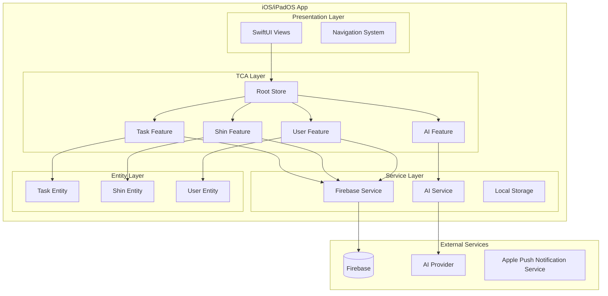
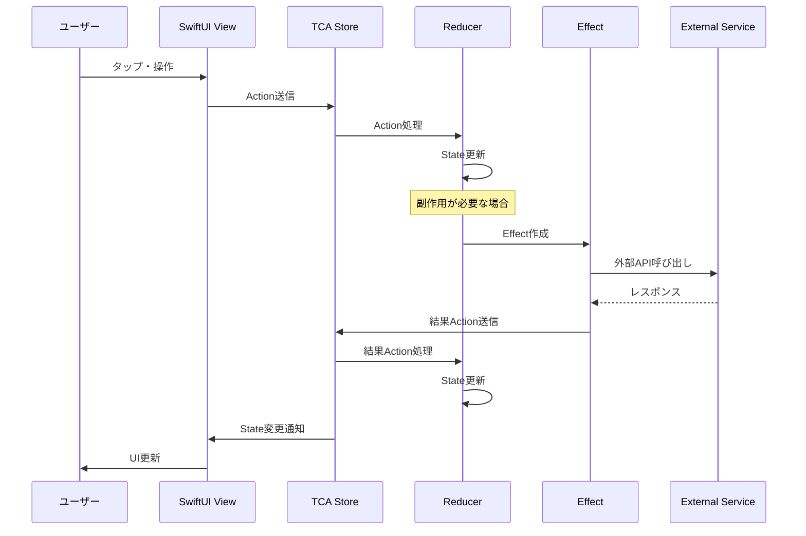
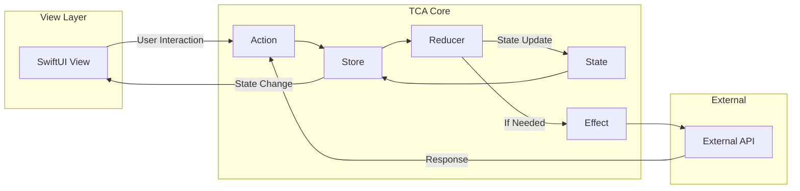

# 02 アーキテクチャ設計書 - タスクしん発見！

## 1. はじめに

このドキュメントは、子供向けタスク管理アプリ「タスクしん発見！」のソフトウェアアーキテクチャ設計について記述します。本アプリは **The Composable Architecture (TCA)** を採用し、Swift/SwiftUI によるiOS/iPadOS向けアプリケーションとして開発されます。

**前提知識:**
- Swift/SwiftUI の基本的な理解
- iOS アプリ開発の経験
- The Composable Architecture (TCA) の基本概念

## 2. アーキテクチャ目標

本プロジェクトにおけるアーキテクチャ選定では、以下の目標を重視しました：

### 2.1. 主要目標
- **テスト容易性**: 単体テスト、統合テストの実装が容易であること
- **状態管理の明確性**: アプリ全体の状態が予測可能で、デバッグが容易であること
- **モジュール性**: 機能ごとに独立したモジュールとして開発・保守できること
- **スケーラビリティ**: 将来的な機能拡張に対応できる設計であること
- **SwiftUIとの親和性**: SwiftUIの宣言的UIパラダイムと整合性があること
- **AIエージェントとの協調開発のしやすさ**: 明確な構造により、AIが理解・生成しやすいコードベース

### 2.2. 子供向けアプリ特有の要件
- **レスポンシブ性**: タッチ操作に対する即座のフィードバック
- **エラー耐性**: 予期しない操作に対する安全性
- **パフォーマンス**: アニメーションや「しん」とのインタラクションのスムーズな動作

## 3. 採用アーキテクチャ: The Composable Architecture (TCA)

### 3.1. TCA基本概念

**State（状態）**
- アプリケーションの現在の状態を表現する構造体
- イミュータブル（不変）であり、Reducer によってのみ変更される

**Action（アクション）**
- ユーザーインタラクション、システムイベント、ネットワーク応答などを表現する列挙型
- 状態変更のトリガーとなる

**Reducer（リデューサー）**
- Action を受け取り、現在の State から新しい State を生成する純粋関数
- 副作用（Effect）も同時に返すことが可能

**Effect（副作用）**
- 非同期処理、外部APIコール、タイマーなど、副作用を表現
- 最終的にActionとしてStoreに結果を送信

**Store（ストア）**
- State、Reducer、Effect を管理する中央集権的な状態管理システム
- ViewからActionを受け取り、Reducerを実行し、State更新をViewに通知

**Dependencies（依存性）**
- 外部サービス（Firebase、AI API等）への依存性を管理
- テスト時にはモックオブジェクトで置き換え可能

### 3.2. TCA選定の理由

1. **複雑な状態管理への対応**: 
   - 「〇〇しん」の収集・育成状態
   - タスク管理状態
   - ユーザープロファイル
   - AI応答状態
   - 親子間コミュニケーション状態

2. **副作用の明示的な扱い**:
   - Firebase API呼び出し
   - AI API統合
   - プッシュ通知
   - タイマー機能

3. **テスト容易性**:
   - Reducer は純粋関数のため単体テストが容易
   - Dependencies の注入によりモックオブジェクトでのテストが可能

4. **AIエージェントとの親和性**:
   - 明確な状態遷移ルール
   - 一方向データフロー
   - 構造化されたコードパターン

### 3.3. 本プロジェクトにおけるTCA適用方針

- **フィーチャーベースのモジュール分割**: 主要機能ごとに独立したTCAフィーチャーとして実装
- **階層的なStore合成**: ルートStoreから各フィーチャーStoreへの委譲
- **共通状態の分離**: Entity層での共有データモデル定義

## 4. 高レベルシステム図

### 4.1. システム構成概要



### 4.2. データフロー概要



## 5. 主要なアーキテクチャパターンと決定事項

### 5.1. 状態管理パターン

**一方向データフロー**
```swift
// 例: タスク完了のフロー
View → Action.taskCompleted(id) → Reducer → Effect.updateTaskStatus → Action.taskStatusUpdated → State更新 → View再描画
```

**階層的な状態構造**
```swift
struct AppState {
    var tasks: TaskFeature.State = .init()
    var shins: ShinFeature.State = .init()
    var user: UserFeature.State = .init()
    var ai: AIFeature.State = .init()
}
```

### 5.2. 副作用処理パターン

**Firebase連携の基本パターン**
```swift
case .loadTasks:
    return .run { send in
        let tasks = try await dependencies.firebaseService.fetchTasks()
        await send(.tasksLoaded(tasks))
    }
```

**AIサービス連携パターン**
```swift
case .requestHint(let taskId):
    return .run { send in
        let hint = try await dependencies.aiService.generateHint(for: taskId)
        await send(.hintReceived(hint))
    }
```

### 5.3. 依存性管理

**DependencyKey実装例**
```swift
struct FirebaseServiceKey: DependencyKey {
    static let liveValue: FirebaseService = LiveFirebaseService()
    static let testValue: FirebaseService = MockFirebaseService()
}
```

**フィーチャーでの依存性利用**
```swift
struct TaskFeature: Reducer {
    @Dependency(\.firebaseService) var firebaseService
    // ...
}
```

### 5.4. ナビゲーション戦略

**NavigationStackStore活用**
```swift
NavigationStackStore(path: \.$path) {
    TaskListView(store: store.scope(state: \.tasks, action: \.tasks))
} destination: { store in
    // 画面遷移先の定義
}
```

**モーダル表示（Sheet/FullScreenCover）**
```swift
.sheet(store: store.scope(state: \.$destination.shinDetail, action: \.destination.shinDetail)) {
    ShinDetailView(store: $0)
}
```

### 5.5. モジュール性とフィーチャー分割

**主要フィーチャー構成**
- `TaskFeature`: タスク管理機能
- `ShinFeature`: 「〇〇しん」関連機能（収集・育成・インタラクション）
- `UserFeature`: ユーザープロファイル・認証
- `AIFeature`: AIヒント・称賛システム
- `NotificationFeature`: 通知管理
- `ParentFeature`: 保護者向け機能

**フィーチャー間通信**
```swift
// ルートReducerでのフィーチャー連携
case .tasks(.taskCompleted(let taskId)):
    // タスク完了時に「しん」の成長処理を実行
    return .merge(
        .send(.shins(.checkGrowthForTask(taskId))),
        .send(.ai(.requestCelebration(taskId)))
    )
```

### 5.6. エラーハンドリング

**統一的エラー処理**
```swift
enum AppError: LocalizedError {
    case network(NetworkError)
    case firebase(FirebaseError)
    case ai(AIError)
    case validation(ValidationError)
}

// Reducerでのエラーハンドリング
case .failure(let error):
    state.errorState = ErrorState(error: error, isPresented: true)
    return .none
```

## 6. データフロー詳細

### 6.1. TCA内の一方向データフロー



### 6.2. 典型的なユーザーフロー例：タスク完了

1. **ユーザーアクション**: 子供がタスク完了ボタンをタップ
2. **Action送信**: `.taskCompleted(taskId)`
3. **Reducer処理**: 
   - ローカル状態を「完了中」に更新
   - Firebase更新のEffect発行
4. **Effect実行**: Firebaseにタスク完了を送信
5. **結果Action**: `.taskUpdateSucceeded` または `.taskUpdateFailed`
6. **最終State更新**: 成功時はUI更新、失敗時はエラー表示

## 7. バックエンド (Firebase) との連携

### 7.1. Firebase連携パターン

**Firestore リアルタイムリスナー**
```swift
case .startListening:
    return .run { send in
        for await tasks in dependencies.firebaseService.tasksStream() {
            await send(.tasksUpdated(tasks))
        }
    }
```

**データ同期戦略**
```swift
// 楽観的更新パターン
case .completeTask(let id):
    state.tasks[id]?.status = .completed  // 即座にUI更新
    return .run { send in
        try await dependencies.firebaseService.updateTask(id, status: .completed)
        await send(.taskUpdateConfirmed(id))
    } catch: { error, send in
        await send(.taskUpdateFailed(id, error))  // 失敗時は巻き戻し
    }
```

### 7.2. オフライン対応

**Firestoreオフラインキャッシュ活用**
- Firestoreの標準オフライン機能を最大限活用
- ネットワーク状態の監視
- 同期状態のUI表示

```swift
struct NetworkState {
    var isOnline: Bool = true
    var pendingSyncs: [SyncItem] = []
}
```

## 8. ローカルデータ永続化戦略

### 8.1. 基本方針

**主要戦略: Firestoreオフラインキャッシュ**
- Firestoreの永続化層を主要なローカルストレージとして活用
- アプリ起動時の高速化
- オフライン時の読み取り専用アクセス

**補完的活用: SwiftData（将来検討）**
- ローカル専用データ（一時的な設定、キャッシュ等）
- 高度なオフライン機能が必要になった場合の選択肢

### 8.2. データ永続化パターン

```swift
// 主要データはFirestore経由
@Dependency(\.firebaseService) var firebaseService

// ローカル設定やキャッシュ用
@Dependency(\.userDefaults) var userDefaults
```

## 9. 参考資料

### 9.1. The Composable Architecture関連

**公式ドキュメント:**
- [The Composable Architecture - Point-Free](https://github.com/pointfreeco/swift-composable-architecture)
- [TCA Documentation](https://pointfreeco.github.io/swift-composable-architecture/)
- [Point-Free Episodes](https://www.pointfree.co/collections/composable-architecture)

**重要なリソース:**
- [TCA Migration Guides](https://pointfreeco.github.io/swift-composable-architecture/main/documentation/composablearchitecture/migratingto1.0)
- [Testing in TCA](https://pointfreeco.github.io/swift-composable-architecture/main/documentation/composablearchitecture/testing)
- [Navigation in TCA](https://pointfreeco.github.io/swift-composable-architecture/main/documentation/composablearchitecture/navigation)

### 9.2. 関連技術資料

**SwiftUI + TCA:**
- [Building SwiftUI apps with TCA](https://www.pointfree.co/collections/swiftui)

**Firebase連携:**
- [Firebase iOS SDK Documentation](https://firebase.google.com/docs/ios/setup)
- [Firestore Offline Capabilities](https://firebase.google.com/docs/firestore/manage-data/enable-offline)

**依存性管理:**
- [Swift Dependencies](https://github.com/pointfreeco/swift-dependencies)

### 9.3. アーキテクチャ参考事例

- [TCA Case Studies](https://github.com/pointfreeco/swift-composable-architecture/tree/main/Examples)
- [Community Examples](https://github.com/topics/composable-architecture)

---

**更新履歴:**
- 2024-12: 初版作成（TCA 1.x系ベース）

**関連ドキュメント:**
- [`docs/01_REQUIREMENTS.md`](./01_REQUIREMENTS.md): 要件定義書
- [`docs/03_CODING_CONVENTIONS.md`](./03_CODING_CONVENTIONS.md): コーディング規約
- [`docs/04_BACKEND_INTEGRATION_GUIDELINES.md`](./04_BACKEND_INTEGRATION_GUIDELINES.md): バックエンド連携ガイドライン 
