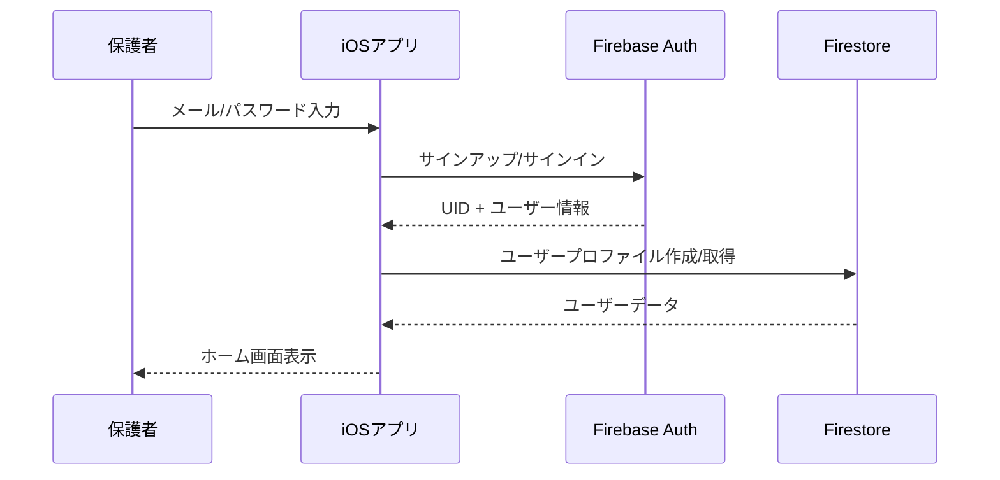

# 04 バックエンド連携ガイドライン - タスクしん発見！

## 1. はじめに

このドキュメントは、タスクしん発見！プロジェクトにおけるFirebaseサービスの利用方針、データモデリング、セキュリティルール、およびその他のバックエンド連携に関する規約と指針を定めます。

**本プロジェクトにおけるFirebaseの役割:**
- **ユーザー認証**: Firebase Authentication
- **データベース**: Cloud Firestore
- **サーバーレス処理**: Cloud Functions for Firebase
- **プッシュ通知**: Firebase Cloud Messaging (FCM)
- **設定管理**: Firebase Remote Config（将来検討）

**このガイドラインの目的:**
- Firebase連携の一貫した実装指針
- データセキュリティの確保
- スケーラブルなデータ構造の構築
- 効率的な開発プロセスの確立

## 2. Firebaseプロジェクト設定と構成管理

### 2.1. プロジェクト構成

**環境分離方針（MVP段階）:**
- **開発・本番共通**: 単一のFirebaseプロジェクトを使用
- **将来的な分離**: 本格リリース時に本番環境を分離

**プロジェクト設定:**
```
Firebase Project: task-shin-hakken-mvp
Bundle ID: com.yourcompany.taskshinHakken
```

### 2.2. GoogleService-Info.plistの管理

**バージョン管理:**
- `.gitignore`に含めず、リポジトリに含める
- センシティブ情報は含まれないため、チーム共有が可能
- 環境ごとのファイル管理は将来検討

**配置場所:**
```
TaskShinHakken.Product/
├── GoogleService-Info.plist  // メインアプリ用
└── Info.plist
```

### 2.3. Firebase SDK設定

**AppDelegate.swift**:
```swift
import Firebase
import FirebaseFirestore

class AppDelegate: NSObject, UIApplicationDelegate {
    func application(
        _ application: UIApplication,
        didFinishLaunchingWithOptions launchOptions: [UIApplication.LaunchOptionsKey: Any]?
    ) -> Bool {
        FirebaseApp.configure()
        
        // Firestoreオフライン永続化を有効にする
        let settings = FirestoreSettings()
        settings.isPersistenceEnabled = true
        settings.cacheSizeBytes = FirestoreCacheSizeUnlimited
        Firestore.firestore().settings = settings
        
        return true
    }
}
```

## 3. Authentication (Firebase Authentication)

### 3.1. 認証方式

**メイン認証: メール/パスワード認証**
- 保護者向けのアカウント作成・ログイン
- パスワードリセット機能

**認証フロー:**


### 3.2. ユーザーセッション管理

**TCAでの認証状態管理:**
```swift
struct AuthFeature: Reducer {
    struct State: Equatable {
        var currentUser: User?
        var isSignedIn: Bool {
            currentUser != nil
        }
        var authenticationState: AuthenticationState = .unauthenticated
    }
    
    enum Action {
        case authStateChanged(User?)
        case signIn(email: String, password: String)
        case signOut
        case signInResponse(Result<User, AuthError>)
    }
}
```

### 3.3. UID とアプリ内データの紐付け

**基本方針:**
- Firebase AuthのUIDを全てのユーザーデータのプライマリキーとして使用
- ユーザードキュメントのIDにはUIDを直接使用

```swift
// ユーザーデータの構造例
struct UserProfile {
    let uid: String  // Firebase Auth UID
    let email: String
    let displayName: String
    let createdAt: Date
    let children: [String]  // 子供のUID配列
}
```

### 3.4. 認証エラーハンドリング

```swift
enum AuthError: LocalizedError, Equatable {
    case invalidEmail
    case weakPassword
    case emailAlreadyInUse
    case userNotFound
    case wrongPassword
    case networkError
    case unknown(String)
    
    var errorDescription: String? {
        switch self {
        case .invalidEmail:
            return "有効なメールアドレスを入力してください"
        case .weakPassword:
            return "パスワードは6文字以上で入力してください"
        case .emailAlreadyInUse:
            return "このメールアドレスは既に使用されています"
        case .userNotFound:
            return "ユーザーが見つかりません"
        case .wrongPassword:
            return "パスワードが正しくありません"
        case .networkError:
            return "ネットワークエラーが発生しました"
        case .unknown(let message):
            return "認証エラー: \(message)"
        }
    }
}
```

## 4. Database (Cloud Firestore)

### 4.1. データモデル詳説

#### 4.1.1. コレクション構造概要

```
/users/{uid}                    // 保護者ユーザー
/children/{childId}             // 子供プロファイル
/tasks/{taskId}                 // タスクデータ
/shin_definitions/{shinId}      // 「しん」マスターデータ
/user_shin_collections/{userId}/shins/{shinId}  // ユーザーが収集した「しん」
/families/{familyId}            // 家族グループ（将来拡張用）
```

#### 4.1.2. 詳細データモデル

**Users Collection (`/users/{uid}`)**
```typescript
interface UserProfile {
    uid: string;                // Firebase Auth UID
    email: string;             // メールアドレス
    displayName: string;       // 表示名
    photoURL?: string;         // プロフィール画像URL
    createdAt: Timestamp;      // アカウント作成日時
    updatedAt: Timestamp;      // 最終更新日時
    children: string[];        // 管理している子供のID配列
    settings: {
        notifications: boolean;
        language: string;      // 'ja', 'en'
    };
}
```

**Children Collection (`/children/{childId}`)**
```typescript
interface ChildProfile {
    id: string;               // 子供固有のID
    parentId: string;         // 保護者のUID
    name: string;             // 子供の名前
    avatarUrl?: string;       // アバター画像URL
    birthYear?: number;       // 生年（年齢計算用）
    createdAt: Timestamp;     // プロファイル作成日時
    settings: {
        preferredShinTypes: string[];  // 好きな「しん」タイプ
        difficultyLevel: number;       // タスク難易度レベル 1-5
    };
}
```

**Tasks Collection (`/tasks/{taskId}`)**
```typescript
interface TaskItem {
    id: string;               // タスクID
    childId: string;          // 対象の子供ID
    parentId: string;         // 作成した保護者ID
    title: string;            // タスクタイトル
    description?: string;     // タスク詳細
    category: TaskCategory;   // カテゴリ
    priority: TaskPriority;   // 優先度
    status: TaskStatus;       // ステータス
    associatedShinTypes: string[];  // 関連する「しん」タイプ
    pointsReward: number;     // 獲得ポイント
    createdAt: Timestamp;     // 作成日時
    updatedAt: Timestamp;     // 最終更新日時
    dueDate?: Timestamp;      // 期限
    completedAt?: Timestamp;  // 完了日時
    repeatConfig?: {          // 繰り返し設定
        frequency: 'daily' | 'weekly' | 'monthly';
        days?: number[];      // 曜日指定 (0=日曜)
    };
}

enum TaskCategory {
    Study = 'study',          // お勉強
    Housework = 'housework',  // お手伝い
    SelfCare = 'selfCare',    // 身の回り
    Creative = 'creative',    // 創作活動
    Exercise = 'exercise',    // 運動
    Social = 'social'         // 社会活動
}

enum TaskStatus {
    NotStarted = 'notStarted',
    InProgress = 'inProgress',
    Completed = 'completed',
    Skipped = 'skipped'
}
```

**Shin Definitions Collection (`/shin_definitions/{shinId}`)**
```typescript
interface ShinDefinition {
    id: string;               // しんID
    name: string;             // しん名（例：「お片付けしん」）
    category: string;         // カテゴリ
    description: string;      // 説明文
    imageUrl: string;         // 基本画像URL
    rarity: ShinRarity;       // レアリティ
    baseGrowthMultiplier: number;  // 成長倍率
    maxLevel: number;         // 最大レベル
    unlockConditions: {       // 解放条件
        requiredTaskCount: number;
        requiredTaskCategories: TaskCategory[];
    };
    evolutionStages?: {       // 進化段階
        level: number;
        imageUrl: string;
        name: string;
    }[];
}

enum ShinRarity {
    Common = 'common',        // 普通
    Uncommon = 'uncommon',    // 珍しい
    Rare = 'rare',            // レア
    Epic = 'epic',            // エピック
    Legendary = 'legendary'   // 伝説
}
```

**User Shin Collections (`/user_shin_collections/{userId}/shins/{shinId}`)**
```typescript
interface UserShinData {
    shinId: string;           // 「しん」定義ID
    userId: string;           // ユーザーID（保護者or子供）
    level: number;            // 現在レベル
    experience: number;       // 経験値
    discoveredAt: Timestamp;  // 発見日時
    lastInteractionAt: Timestamp;  // 最後のインタラクション
    customName?: string;      // カスタム名前
    moodLevel: number;        // 機嫌レベル (0-100)
    totalTasksHelped: number; // 手伝ったタスク数
}
```

### 4.2. 命名規則

**コレクション名:**
- 複数形、スネークケース
- 例: `users`, `shin_definitions`, `user_shin_collections`

**ドキュメントID:**
- 自動生成IDまたは意味のあるキー
- UUIDまたはFirestore自動生成IDを推奨

**フィールド名:**
- camelCase
- ブーリアン値: `is...`プレフィックス
- 日時: `...At`サフィックス

### 4.3. インデックス設定

**主要クエリに対するインデックス:**

```javascript
// tasks コレクション
// 子供IDとステータスでの検索
{
  collectionGroup: 'tasks',
  fields: [
    { fieldPath: 'childId', order: 'ASCENDING' },
    { fieldPath: 'status', order: 'ASCENDING' },
    { fieldPath: 'createdAt', order: 'DESCENDING' }
  ]
}

// user_shin_collections サブコレクション
// レベルでのソート
{
  collectionGroup: 'shins',
  fields: [
    { fieldPath: 'userId', order: 'ASCENDING' },
    { fieldPath: 'level', order: 'DESCENDING' }
  ]
}
```

### 4.4. オフライン永続性

**基本設定:**
```swift
// AppDelegate.swiftで設定済み
let settings = FirestoreSettings()
settings.isPersistenceEnabled = true
settings.cacheSizeBytes = FirestoreCacheSizeUnlimited
```

**TCAでのオフライン対応:**
```swift
case .loadTasks:
    return .run { send in
        // Firestoreは自動的にキャッシュから読み込み
        let tasks = try await firebaseService.fetchTasks(childId: childId)
        await send(.tasksLoaded(tasks))
    }
```

### 4.5. セキュリティルール

**基本方針:**
- 認証されたユーザーのみアクセス可能
- ユーザーは自身および管理する子供のデータのみアクセス可能
- 「しん」の定義データは読み取り専用（全ユーザー）

**Firestore Security Rules:**
```javascript
rules_version = '2';
service cloud.firestore {
  match /databases/{database}/documents {
    // ユーザーは自身のプロファイルのみアクセス可能
    match /users/{userId} {
      allow read, write: if request.auth != null && request.auth.uid == userId;
    }
    
    // 子供プロファイル：保護者のみアクセス可能
    match /children/{childId} {
      allow read, write: if request.auth != null && 
        request.auth.uid == resource.data.parentId;
      allow create: if request.auth != null && 
        request.auth.uid == request.resource.data.parentId;
    }
    
    // タスク：保護者と対象の子供のみアクセス可能
    match /tasks/{taskId} {
      allow read, write: if request.auth != null && 
        (request.auth.uid == resource.data.parentId ||
         request.auth.uid == resource.data.childId);
      allow create: if request.auth != null && 
        request.auth.uid == request.resource.data.parentId;
    }
    
    // 「しん」定義：全認証ユーザーが読み取り可能
    match /shin_definitions/{shinId} {
      allow read: if request.auth != null;
      allow write: if false; // 管理者のみ更新可能（Functions経由）
    }
    
    // ユーザーの「しん」コレクション
    match /user_shin_collections/{userId}/shins/{shinId} {
      allow read, write: if request.auth != null && 
        request.auth.uid == userId;
    }
  }
}
```

## 5. Serverless Logic (Cloud Functions for Firebase)

### 5.1. MVPでのユースケース

**主要なCloud Functions:**

1. **タスク完了通知トリガー**
2. **「しん」成長処理**
3. **日次/週次の統計生成**
4. **ユーザーアカウント削除処理**

### 5.2. 関数の命名規則とファイル構成

**プロジェクト構造:**
```
functions/
├── src/
│   ├── triggers/
│   │   ├── onTaskCompleted.ts
│   │   ├── onUserCreated.ts
│   │   └── scheduledDailyTasks.ts
│   ├── https/
│   │   ├── generateAIHint.ts
│   │   └── adminTaskOperations.ts
│   ├── shared/
│   │   ├── notifications.ts
│   │   ├── shinGrowth.ts
│   │   └── types.ts
│   └── index.ts
├── package.json
└── tsconfig.json
```

### 5.3. 実装パターン

**Firestoreトリガー例: タスク完了処理**
```typescript
import { onDocumentUpdated } from 'firebase-functions/v2/firestore';
import { sendTaskCompletionNotification } from '../shared/notifications';
import { updateShinGrowth } from '../shared/shinGrowth';

export const onTaskCompleted = onDocumentUpdated(
  'tasks/{taskId}',
  async (event) => {
    const before = event.data?.before.data();
    const after = event.data?.after.data();
    
    // タスクが完了状態に変更されたかチェック
    if (before?.status !== 'completed' && after?.status === 'completed') {
      const taskId = event.params.taskId;
      const taskData = after;
      
      try {
        // 保護者への通知送信
        await sendTaskCompletionNotification(taskData);
        
        // 関連する「しん」の成長処理
        await updateShinGrowth(taskData.childId, taskData.associatedShinTypes);
        
        console.log(`Task completion processed: ${taskId}`);
      } catch (error) {
        console.error(`Error processing task completion: ${error}`);
      }
    }
  }
);
```

**HTTPS関数例: AIヒント生成**
```typescript
import { onRequest } from 'firebase-functions/v2/https';
import { getAuth } from 'firebase-admin/auth';

export const generateAIHint = onRequest(
  { cors: true },
  async (req, res) => {
    try {
      // 認証チェック
      const authHeader = req.headers.authorization;
      if (!authHeader) {
        res.status(401).send('Unauthorized');
        return;
      }
      
      const token = authHeader.split(' ')[1];
      const decodedToken = await getAuth().verifyIdToken(token);
      
      const { taskId, difficulty } = req.body;
      
      // AI API呼び出し（仮想的な実装）
      const hint = await generateHintFromAI(taskId, difficulty);
      
      res.json({ hint });
    } catch (error) {
      console.error('AI hint generation error:', error);
      res.status(500).send('Internal Server Error');
    }
  }
);
```

### 5.4. デプロイ手順

**Firebase CLIでのデプロイ:**
```bash
# Functions ディレクトリに移動
cd functions

# 依存関係のインストール
npm install

# ビルド
npm run build

# デプロイ
firebase deploy --only functions
```

## 6. Push Notifications (Firebase Cloud Messaging - FCM)

### 6.1. 通知の種類

**送信する通知タイプ:**

1. **タスクリマインド**: 「〇〇しんが呼んでるよ！」
2. **タスク完了通知**: 保護者への完了報告
3. **「しん」発見通知**: 新しい「しん」との出会い
4. **成長通知**: 「しん」のレベルアップ
5. **励まし通知**: AIからの応援メッセージ

### 6.2. 通知ペイロード構造

```typescript
interface NotificationPayload {
  notification: {
    title: string;
    body: string;
    imageUrl?: string;
  };
  data: {
    type: NotificationType;
    targetId?: string;  // タスクIDや「しん」IDなど
    childId?: string;
    customData?: string; // JSON文字列
  };
  apns: {
    payload: {
      aps: {
        badge?: number;
        sound: string;
        category?: string;
      };
    };
  };
}

enum NotificationType {
  TaskReminder = 'task_reminder',
  TaskCompleted = 'task_completed',
  ShinDiscovered = 'shin_discovered',
  ShinLevelUp = 'shin_level_up',
  EncouragementMessage = 'encouragement'
}
```

### 6.3. 通知送信システム

**Cloud Functionsでの通知送信:**
```typescript
import { getMessaging } from 'firebase-admin/messaging';

export async function sendTaskCompletionNotification(taskData: any) {
  const message = {
    notification: {
      title: 'タスク完了！',
      body: `${taskData.childName}さんが「${taskData.title}」を完了しました！`,
      imageUrl: 'https://example.com/task-complete-icon.png'
    },
    data: {
      type: 'task_completed',
      taskId: taskData.id,
      childId: taskData.childId
    },
    token: taskData.parentFCMToken
  };
  
  try {
    const response = await getMessaging().send(message);
    console.log('Notification sent successfully:', response);
  } catch (error) {
    console.error('Error sending notification:', error);
  }
}
```

### 6.4. iOS側での通知処理

**AppDelegate.swift:**
```swift
import UserNotifications
import FirebaseMessaging

extension AppDelegate: UNUserNotificationCenterDelegate, MessagingDelegate {
    func application(
        _ application: UIApplication,
        didFinishLaunchingWithOptions launchOptions: [UIApplication.LaunchOptionsKey: Any]?
    ) -> Bool {
        // 通知許可リクエスト
        UNUserNotificationCenter.current().delegate = self
        UNUserNotificationCenter.current().requestAuthorization(options: [.alert, .badge, .sound]) { granted, error in
            // 処理
        }
        
        // FCM設定
        Messaging.messaging().delegate = self
        
        return true
    }
    
    // FCMトークン更新
    func messaging(_ messaging: Messaging, didReceiveRegistrationToken fcmToken: String?) {
        guard let token = fcmToken else { return }
        // Firestoreにトークンを保存
        Task {
            await updateFCMToken(token)
        }
    }
}
```

## 7. その他Firebaseサービス

### 7.1. Remote Config

**MVPでの利用検討:**
- AI称賛メッセージのテンプレート
- 「しん」の出現確率調整
- 機能フラグ（新機能の段階的リリース）

**設定例:**
```json
{
  "ai_praise_messages": {
    "ja": [
      "すごいね！{childName}ちゃん！",
      "{taskName}を頑張ったね！",
      "きっと{shinName}も喜んでるよ！"
    ]
  },
  "shin_discovery_rate": 0.85,
  "feature_flags": {
    "ai_hints_enabled": true,
    "advanced_analytics": false
  }
}
```

### 7.2. Cloud Storage

**将来的な利用計画:**
- アバター画像の保存
- 「しん」のカスタムイラスト
- タスクの写真添付機能

## 8. Firebase利用時のエラーハンドリングとリトライ戦略

### 8.1. クライアント側エラーハンドリング

```swift
enum FirebaseError: LocalizedError, Equatable {
    case notAuthenticated
    case permissionDenied
    case networkError
    case quotaExceeded
    case documentNotFound
    case unknown(String)
    
    var errorDescription: String? {
        switch self {
        case .notAuthenticated:
            return "認証が必要です"
        case .permissionDenied:
            return "アクセス権限がありません"
        case .networkError:
            return "ネットワークエラーが発生しました"
        case .quotaExceeded:
            return "利用制限に達しました"
        case .documentNotFound:
            return "データが見つかりません"
        case .unknown(let message):
            return "Firebase エラー: \(message)"
        }
    }
}
```

### 8.2. リトライ戦略

```swift
struct FirebaseService {
    func fetchTasksWithRetry(childId: String, maxRetries: Int = 3) async throws -> [TaskItem] {
        var lastError: Error?
        
        for attempt in 1...maxRetries {
            do {
                return try await fetchTasks(childId: childId)
            } catch {
                lastError = error
                
                // リトライ可能なエラーかチェック
                if !isRetryableError(error) {
                    throw error
                }
                
                // 指数バックオフ
                let delay = pow(2.0, Double(attempt - 1))
                try await Task.sleep(nanoseconds: UInt64(delay * 1_000_000_000))
            }
        }
        
        throw lastError ?? FirebaseError.unknown("Max retries exceeded")
    }
    
    private func isRetryableError(_ error: Error) -> Bool {
        // ネットワークエラーやサーバーエラーの場合のみリトライ
        if let firestoreError = error as NSError? {
            switch firestoreError.code {
            case FirestoreErrorCode.unavailable.rawValue,
                 FirestoreErrorCode.deadlineExceeded.rawValue,
                 FirestoreErrorCode.internal.rawValue:
                return true
            default:
                return false
            }
        }
        return false
    }
}
```

### 8.3. Cloud Functions側エラーハンドリング

```typescript
export const processTaskCompletion = onDocumentUpdated(
  'tasks/{taskId}',
  async (event) => {
    try {
      // メイン処理
      await handleTaskCompletion(event);
    } catch (error) {
      console.error('Task completion processing failed:', error);
      
      // エラー情報をFirestoreに記録（デバッグ用）
      await logError({
        functionName: 'processTaskCompletion',
        taskId: event.params.taskId,
        error: error.message,
        timestamp: new Date()
      });
      
      // 重要な処理の場合は再試行キューに追加
      if (isCriticalError(error)) {
        await addToRetryQueue({
          taskId: event.params.taskId,
          operation: 'processTaskCompletion',
          retryCount: 0
        });
      }
    }
  }
);
```

---

**更新履歴:**
- 2024-12: 初版作成

**関連ドキュメント:**
- [`docs/01_REQUIREMENTS.md`](./01_REQUIREMENTS.md): 要件定義書
- [`docs/02_ARCHITECTURE.md`](./02_ARCHITECTURE.md): アーキテクチャ設計書
- [`docs/03_CODING_CONVENTIONS.md`](./03_CODING_CONVENTIONS.md): コーディング規約 
