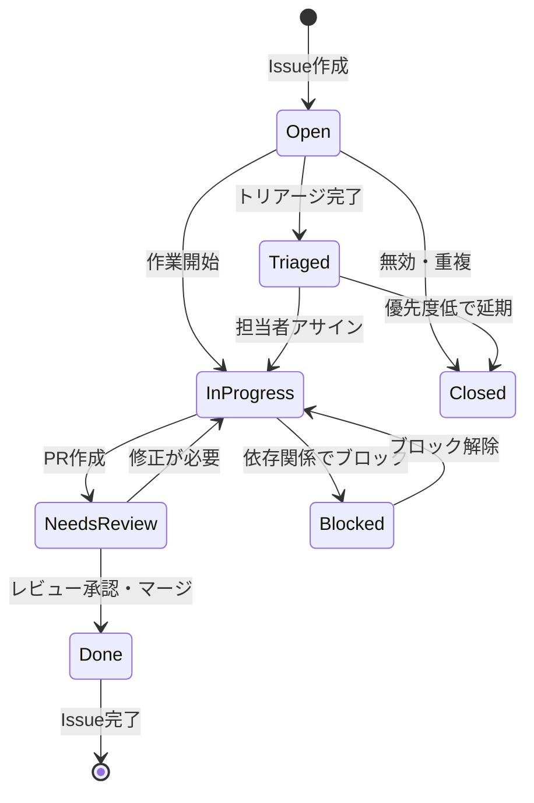

# 06 開発プロセス規約 - タスクしん発見！

## 1. はじめに

このドキュメントは、タスクしん発見！プロジェクトにおける日々の開発作業を円滑に進めるためのプロセスと規約を定めます。バージョン管理、Issue管理、Pull Request運用、コードレビュー、テスト戦略など、AIエージェントとの協調作業においても基本となるワークフローを確立します。

**規律ある開発プロセスの重要性:**
- コードの品質と一貫性の維持
- チーム（人間 + AI）間での効率的な協調作業
- プロジェクトの進捗と課題の可視化
- 安全で確実なリリースプロセス
- 技術的負債の蓄積防止

## 2. バージョン管理 (Git / GitHub)

### 2.1. ブランチ戦略

**採用方針: GitHub Flow簡略版**

```mermaid
gitgraph
    commit id: "Initial"
    branch develop
    checkout develop
    commit id: "Setup TCA"
    commit id: "Add Task Feature"
    branch feature/task-list
    checkout feature/task-list
    commit id: "Implement TaskListView"
    commit id: "Add unit tests"
    checkout develop
    merge feature/task-list
    commit id: "Integrate feature"
    checkout main
    merge develop
    commit id: "Release v1.0.0"
    tag: "v1.0.0"
```

**ブランチ命名規則:**

| ブランチタイプ | 命名パターン | 例 | 用途 |
|---------------|-------------|----|----|
| メイン | `main` | `main` | 本番リリース用 |
| 開発基点 | `develop` | `develop` | 開発の統合ブランチ |
| 機能開発 | `feature/[issue番号]-[簡潔な説明]` | `feature/123-task-management` | 新機能開発 |
| バグ修正 | `fix/[issue番号]-[簡潔な説明]` | `fix/456-shin-animation-bug` | バグ修正 |
| ホットフィックス | `hotfix/[issue番号]-[説明]` | `hotfix/789-critical-crash` | 緊急修正 |
| リリース準備 | `release/[バージョン]` | `release/1.1.0` | リリース準備 |

### 2.2. コミットメッセージ規約

コミットメッセージは、変更内容を明確かつ簡潔に伝えるための重要な情報です。
本プロジェクトでは、GitHubのIssueと自動的に連携させるため、以下の規約を遵守してください。

- **フォーマット**: プレフィックスとして **`#<Issue番号>`** を必ず含める。
- **件名 (Subject)**: 50文字以内で、変更内容を要約して記述する。命令形で書くことが望ましい（例: `Add`, `Fix`, `Refactor`）。
- **本文 (Body)**: 必要に応じて、変更の理由や背景、詳細な実装内容を記述する。

**例:**
```
#4 画面仕様書を追加

Issue #4のタスク「主要画面の定義」の一環として、
docs/08_SCREEN_SPECIFICATIONS.md を新規作成しました。

- 主要画面リストの定義
- 画面遷移図の追加
- 各画面の詳細仕様
```

### 2.3. タグ付け（バージョニング）

**セマンティックバージョニング (SemVer) を採用:**

```
v<MAJOR>.<MINOR>.<PATCH>

例: v1.0.0, v1.1.0, v1.1.1
```

- **MAJOR**: 非互換な変更
- **MINOR**: 後方互換な機能追加
- **PATCH**: 後方互換なバグ修正

**タグ作成例:**
```bash
git tag -a v1.0.0 -m "Initial MVP release"
git push origin v1.0.0
```

## 3. Issueトラッキング (GitHub Issues)

### 3.1. Issue作成規約

**Issue Templateの利用:**

**.github/ISSUE_TEMPLATE/feature_request.md:**
```markdown
---
name: 機能要望
about: 新しい機能の提案
title: '[FEATURE] '
labels: 'feature, needs-triage'
assignees: ''
---

## 機能概要
<!-- 実装したい機能の概要を記述してください -->

## 背景・理由
<!-- なぜこの機能が必要なのかを説明してください -->

## 詳細仕様
<!-- 具体的な実装内容や仕様を記述してください -->

## 受け入れ条件
- [ ] 条件1
- [ ] 条件2
- [ ] 条件3

## 関連Issue
<!-- 関連するIssueがあればリンクしてください -->

## その他
<!-- 補足情報があれば記述してください -->
```

**.github/ISSUE_TEMPLATE/bug_report.md:**
```markdown
---
name: バグ報告
about: バグの報告
title: '[BUG] '
labels: 'bug, needs-triage'
assignees: ''
---

## バグの概要
<!-- どのような問題が発生しているかを記述してください -->

## 再現手順
1. 
2. 
3. 

## 期待される動作
<!-- 本来どのような動作をするべきかを記述してください -->

## 実際の動作
<!-- 実際にどのような動作をしているかを記述してください -->

## 環境
- iOS バージョン: 
- デバイス: 
- アプリバージョン: 

## スクリーンショット
<!-- 必要に応じてスクリーンショットを添付してください -->

## 追加情報
<!-- その他の関連情報があれば記述してください -->
```

### 3.2. ラベル運用

**プロジェクト固有ラベル:**

| ラベル | 色 | 説明 |
|-------|-----|------|
| `mvp` | `#0052CC` | MVP に含まれる重要な機能 |
| `feature` | `#00AA00` | 新機能 |
| `bug` | `#FF0000` | バグ報告 |
| `ui` | `#FF9900` | UI/UX 関連 |
| `backend` | `#9900FF` | Firebase/サーバー関連 |
| `tca` | `#00CCFF` | TCA アーキテクチャ関連 |
| `shin-system` | `#FFB6C1` | 「しん」システム関連 |
| `ai-integration` | `#FFA500` | AI 連携機能 |
| `priority-high` | `#FF4444` | 優先度高 |
| `priority-medium` | `#FFAA44` | 優先度中 |
| `priority-low` | `#44AAFF` | 優先度低 |
| `needs-triage` | `#CCCCCC` | トリアージが必要 |
| `in-progress` | `#00FF00` | 作業中 |
| `needs-review` | `#FFFF00` | レビュー待ち |
| `blocked` | `#FF0088` | ブロック状態 |

### 3.3. マイルストーン運用

**主要マイルストーン:**

1. **MVP リリース** (目標: 3ヶ月)
   - 基本的なタスク管理機能
   - 数種類の「しん」システム
   - Firebase 連携
   - 基本的な親子機能

2. **v1.1 機能拡張** (目標: MVP + 2ヶ月)
   - AI ヒント機能の充実
   - 追加の「しん」キャラクター
   - 詳細な統計・レポート機能

3. **v1.2 体験向上** (目標: v1.1 + 2ヶ月)
   - アニメーション・サウンド強化
   - アクセシビリティ改善
   - パフォーマンス最適化

### 3.4. Issue ライフサイクル



## 4. Pull Request (PR) の運用

### 4.1. PR作成ガイドライン

**PR作成タイミング:**
- 機能実装が完了し、テストも作成済み
- セルフレビューを実施済み
- CI/CD チェックをパス

**PR サイズの目安:**
- **小**: ~200行 (推奨)
- **中**: 200-500行 (許容)
- **大**: 500行~ (分割を検討)

### 4.2. PR テンプレート

**.github/PULL_REQUEST_TEMPLATE.md:**
```markdown
## 変更内容
<!-- このPRで何を変更したかを記述してください -->

## 関連Issue
Closes #[Issue番号]

## 変更の種類
- [ ] 新機能 (feature)
- [ ] バグ修正 (fix)
- [ ] リファクタリング (refactor)
- [ ] ドキュメント更新 (docs)
- [ ] テスト追加・修正 (test)
- [ ] その他 (chore)

## テスト内容
- [ ] ユニットテスト追加
- [ ] 手動テスト実施
- [ ] デバイステスト (iPhone/iPad)
- [ ] アクセシビリティ確認

## セルフチェックリスト
- [ ] コーディング規約に準拠
- [ ] 適切なエラーハンドリング実装
- [ ] ログ出力の追加（必要に応じて）
- [ ] ドキュメント更新（必要に応じて）
- [ ] Breaking Change なし（またはマイグレーション手順を記載）

## スクリーンショット
<!-- UI 変更がある場合はスクリーンショットを添付してください -->

## 補足情報
<!-- その他の重要な情報があれば記述してください -->
```

### 4.3. PR のマージ戦略

**Squash and Merge を推奨:**
- 機能単位でのクリーンなコミット履歴
- 詳細な変更履歴は PR で確認可能
- `develop` ブランチの履歴をシンプルに保持

**例外: Merge Commit**
- 大きな機能リリース時
- 複数の関連 PR をまとめる場合

## 5. コードレビュープロセス

### 5.1. レビュー担当と責任

**人間によるレビュー (必須):**
- ビジネスロジックの正当性
- アーキテクチャ設計への適合
- セキュリティ上の問題
- 最終的な品質判断

**AI エージェントの成果物に対する特別な観点:**
- 生成されたコードの動作確認
- エッジケースの考慮
- 最新APIの使用
- プロジェクト固有の規約遵守

### 5.2. レビュー観点

**技術的観点:**
1. **アーキテクチャ準拠**: TCA 原則の遵守
2. **コーディング規約**: [`docs/03_CODING_CONVENTIONS.md`](./03_CODING_CONVENTIONS.md) 準拠
3. **パフォーマンス**: 不要な処理やメモリリーク
4. **セキュリティ**: 認証、データ保護、入力検証
5. **エラーハンドリング**: 適切な例外処理とユーザーフィードバック

**UX/機能的観点:**
1. **要件適合**: [`docs/01_REQUIREMENTS.md`](./01_REQUIREMENTS.md) との整合性
2. **ユーザビリティ**: 直感的な操作性
3. **アクセシビリティ**: [`docs/05_UI_UX_GUIDELINES.md`](./05_UI_UX_GUIDELINES.md) 準拠
4. **レスポンシブ性**: iPhone/iPad 対応

### 5.3. レビューフィードバック例

**建設的なフィードバック例:**
```markdown
### 🔧 提案 (Suggestion)
この部分はTCAの`Effect`を使って非同期処理にできそうです：

```swift
// 現在
DispatchQueue.main.async {
    // 処理
}

// 提案
return .run { send in
    await send(.updateUI)
}
```

### ❓ 質問 (Question)  
このエラーケースでユーザーにどのようなフィードバックを表示する予定ですか？

### 🎯 必須修正 (Required)
Firebase認証チェックが不足しています。セキュリティ上のリスクがあります。

### 👍 良い点 (Praise)
エラーハンドリングが適切に実装されており、ユーザー体験が向上していますね！
```

### 5.4. 承認とマージ

**マージ条件:**
- [ ] 1名以上の承認 (Approve)
- [ ] CI/CD チェック全てパス
- [ ] コンフリクト解決済み
- [ ] 関連 Issue の受け入れ条件達成

## 6. テスト戦略

### 6.1. テスト階層

```mermaid
pyramid
    title Test Pyramid
    
    top: E2E Tests
    middle: Integration Tests
    bottom: Unit Tests
```

**ユニットテスト (70%)**
- TCA Reducer のテスト
- ビジネスロジックの単体テスト
- ユーティリティ関数のテスト

**統合テスト (20%)**
- Firebase 連携のテスト (Mock 使用)
- フィーチャー間連携のテスト
- TCA Store の統合テスト

**E2E テスト (10%)**
- 主要ユーザーフローのテスト
- 重要な機能の回帰テスト

### 6.2. TCA テストの実装例

```swift
import ComposableArchitecture
import XCTest

@testable import TaskShinHakken

final class TaskFeatureTests: XCTestCase {
    func testTaskCompletion() async {
        let store = TestStore(
            initialState: TaskFeature.State(
                tasks: [
                    TaskItem(id: "1", title: "Test Task", status: .notStarted)
                ]
            )
        ) {
            TaskFeature()
        } withDependencies: {
            $0.taskService = MockTaskService()
            $0.uuid = .constant(UUID(uuidString: "00000000-0000-0000-0000-000000000000")!)
        }
        
        await store.send(.completeTask("1")) {
            $0.tasks[0].status = .completed
        }
        
        await store.receive(.taskCompletionResponse(.success("1")))
    }
}
```

### 6.3. テストカバレッジ目標

**カバレッジ目標:**
- **全体**: 80% 以上
- **Reducer**: 90% 以上
- **ビジネスロジック**: 95% 以上
- **UI コンポーネント**: 60% 以上

**測定コマンド:**
```bash
# テスト実行とカバレッジレポート生成
xcodebuild test \
  -scheme TaskShinHakken \
  -destination 'platform=iOS Simulator,name=iPhone 15' \
  -enableCodeCoverage YES \
  -derivedDataPath ./DerivedData

# カバレッジレポート確認
xcrun xccov view --report --only-targets ./DerivedData/Logs/Test/*.xcresult
```

## 7. ビルドとリリースプロセス

### 7.1. ビルド環境

**開発ビルド:**
```bash
# Debug ビルド
xcodebuild build \
  -scheme TaskShinHakken \
  -configuration Debug \
  -destination 'platform=iOS Simulator,name=iPhone 15'
```

**リリースビルド:**
```bash
# Release ビルド
xcodebuild archive \
  -scheme TaskShinHakken \
  -configuration Release \
  -destination 'generic/platform=iOS' \
  -archivePath ./build/TaskShinHakken.xcarchive
```

### 7.2. バージョン管理

**バージョン更新手順:**

1. **プロジェクト設定更新**
   ```bash
   # Marketing Version (CFBundleShortVersionString)
   # 1.0.0 → 1.1.0
   
   # Current Project Version (CFBundleVersion)  
   # 1 → 2
   ```

2. **CHANGELOG.md 更新**
   ```markdown
   ## [1.1.0] - 2024-XX-XX
   
   ### Added
   - 新しい「しん」キャラクター3種類
   - AI ヒント機能の改善
   
   ### Fixed
   - タスク完了時のアニメーション不具合
   - iPad でのレイアウト崩れ
   
   ### Changed
   - ユーザーインターフェースの微調整
   ```

3. **Git タグ作成**
   ```bash
   git tag -a v1.1.0 -m "Release version 1.1.0"
   git push origin v1.1.0
   ```

### 7.3. リリース前チェックリスト

**技術チェック:**
- [ ] 全てのテストがパス
- [ ] ビルドエラー・警告なし
- [ ] Memory Leak チェック
- [ ] 主要デバイスでの動作確認
- [ ] アクセシビリティチェック

**機能チェック:**
- [ ] 新機能の動作確認
- [ ] 既存機能の回帰テスト
- [ ] エラーケースの確認
- [ ] オフライン動作確認

**ドキュメントチェック:**
- [ ] README.md 更新
- [ ] CHANGELOG.md 更新
- [ ] App Store 用説明文準備
- [ ] スクリーンショット更新

## 8. 継続的インテグレーション (CI/CD)

### 8.1. GitHub Actions 設定

**.github/workflows/ci.yml:**
```yaml
name: CI

on:
  push:
    branches: [ main, develop ]
  pull_request:
    branches: [ main, develop ]

jobs:
  test:
    runs-on: macos-latest
    
    steps:
    - uses: actions/checkout@v4
    
    - name: Select Xcode version
      run: sudo xcode-select -s /Applications/Xcode_15.2.app/Contents/Developer
    
    - name: Build and test
      run: |
        xcodebuild test \
          -scheme TaskShinHakken \
          -destination 'platform=iOS Simulator,name=iPhone 15' \
          -enableCodeCoverage YES
    
    - name: SwiftLint
      run: |
        brew install swiftlint
        swiftlint --strict
```

### 8.2. 自動化されるチェック

**PR 作成時の自動チェック:**
- Swift コンパイル
- ユニットテスト実行
- SwiftLint チェック
- コードカバレッジ測定

**main ブランチマージ時:**
- リリースビルド作成
- Archive 生成
- App Store Connect への自動アップロード (将来検討)

---

**更新履歴:**
- 2024-12: 初版作成

**関連ドキュメント:**
- [`docs/01_REQUIREMENTS.md`](./01_REQUIREMENTS.md): 要件定義書
- [`docs/02_ARCHITECTURE.md`](./02_ARCHITECTURE.md): アーキテクチャ設計書
- [`docs/03_CODING_CONVENTIONS.md`](./03_CODING_CONVENTIONS.md): コーディング規約
- [`docs/07_AI_AGENT_CODING_GUIDELINES.md`](./07_AI_AGENT_CODING_GUIDELINES.md): AIエージェント利用ガイドライン 
