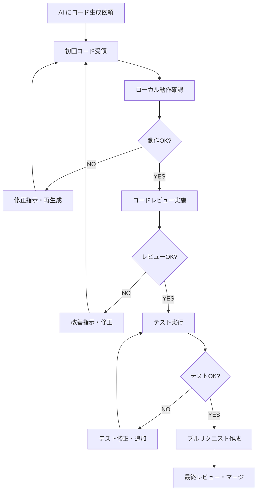

# 07 AIエージェント利用ガイドライン - タスクしん発見！

## 1. はじめに

このドキュメントは、タスクしん発見！プロジェクトにおけるAI開発エージェント（Claude、ChatGPT等）との効果的な協調作業を実現するためのガイドラインです。AIにコーディング作業を依頼し、その成果物をプロジェクトに統合するための具体的な指示方法、ベストプラクティス、品質管理手順を定めます。

**本プロジェクトにおけるAIエージェントの役割:**
- Swift/SwiftUI コードの生成と実装支援
- TCA アーキテクチャパターンの適用
- テストコードの作成
- リファクタリングとコード改善
- ドキュメント作成支援

**人間とAIの協調作業の成功要因:**
- 明確で具体的な指示
- プロジェクト固有の文脈提供
- 段階的なタスク分割
- 継続的なフィードバックとイテレーション
- 最終的な品質判断は人間が実施

## 2. プロンプトエンジニアリングベストプラクティス

### 2.1. 効果的な指示の原則

**1. 明確で具体的な指示**

```markdown
❌ 悪い例:
「タスク機能を作って」

✅ 良い例:
「SwiftUIとTCAを使って、以下の仕様でタスク一覧表示機能を実装してください：

1. TaskItem配列を表示するList
2. 各タスクは完了状態に応じて異なる表示
3. タスクタップで詳細画面に遷移
4. プルリフレッシュ機能付き
5. エラー状態の適切な表示

TaskItemの定義：
struct TaskItem: Identifiable, Equatable {
    let id: UUID
    let title: String
    let status: TaskStatus
    let pointsReward: Int
}

TCAのState/Action/Reducerも含めて実装してください。」
```

**2. コンテキストの提供**

```markdown
### プロジェクト情報
- アプリ名: タスクしん発見！
- アーキテクチャ: TCA (The Composable Architecture)
- UI: SwiftUI
- 対象: iOS 17+, iPadOS 17+

### 関連ドキュメント
以下のドキュメントを参考にしてください：
- `docs/01_REQUIREMENTS.md`: 機能要件
- `docs/02_ARCHITECTURE.md`: TCAアーキテクチャ方針
- `docs/03_CODING_CONVENTIONS.md`: コーディング規約

### 関連Issue
#123: タスク管理機能の実装

### 既存コード
現在のAppState：
[既存コードを貼り付け]
```

**3. 期待する成果物の明示**

```markdown
### 期待する出力
以下のファイル構成で実装してください：

1. `TaskFeature.swift` - State/Action/Reducer
2. `TaskListView.swift` - SwiftUI View
3. `TaskService.swift` - Firebase連携Service
4. `TaskFeatureTests.swift` - ユニットテスト

各ファイルには適切なコメントとエラーハンドリングを含めてください。
```

### 2.2. 段階的なタスク分割

**大きな機能を小さなタスクに分割:**

```markdown
## フェーズ1: 基本実装
1. TaskFeatureのState/Action定義
2. 基本的なReducerロジック
3. シンプルなTaskListView

## フェーズ2: Firebase連携
1. TaskService protocolの定義
2. FirebaseTaskServiceの実装
3. Effect追加とエラーハンドリング

## フェーズ3: UI強化
1. タスク状態別の表示切り替え
2. プルリフレッシュ機能
3. ローディング・エラー状態表示

## フェーズ4: テスト
1. Reducerのユニットテスト
2. Service層のテスト
3. Viewのテスト（可能な範囲で）
```

### 2.3. 反復的な改善

```markdown
### 初回実装後のフィードバック例
「実装ありがとうございます。以下の点を改善してください：

1. TCAのnavigationAPIを使ってタスク詳細画面への遷移を実装
2. アクセシビリティラベルの追加
3. 和風ファンタジーテーマに合うUI調整（緑系の色使い）

修正版を提供してください。」
```

## 3. プロジェクトドキュメントの参照と遵守

### 3.1. 必須参照ドキュメント

AIエージェントには以下のドキュメントの内容を理解し、遵守してコードを生成することを求めます：

**設計・要件関連:**
- [`docs/01_REQUIREMENTS.md`](./01_REQUIREMENTS.md): 機能要件、「しん」システム仕様
- [`docs/02_ARCHITECTURE.md`](./02_ARCHITECTURE.md): TCA利用方針、システム設計

**実装関連:**
- [`docs/03_CODING_CONVENTIONS.md`](./03_CODING_CONVENTIONS.md): Swift コーディング規約
- [`docs/04_BACKEND_INTEGRATION_GUIDELINES.md`](./04_BACKEND_INTEGRATION_GUIDELINES.md): Firebase 連携規約
- [`docs/05_UI_UX_GUIDELINES.md`](./05_UI_UX_GUIDELINES.md): UI/UX 指針

### 3.2. ドキュメント参照の指示例

```markdown
### 指示テンプレート

AIに以下の形式で指示を出してください：

「以下のプロジェクトドキュメントの内容を踏まえて実装してください：

**アーキテクチャ方針 (docs/02_ARCHITECTURE.md より):**
- TCAの一方向データフローに従う
- EffectでFirebase非同期処理を実装
- 依存性はDependencyKeyで注入

**コーディング規約 (docs/03_CODING_CONVENTIONS.md より):**
- 命名規則: ActionはUpperCamelCase動詞形
- エラーハンドリング: Result型を活用
- コメント: 複雑なロジックには説明を追加

**UI/UX指針 (docs/05_UI_UX_GUIDELINES.md より):**
- 和風ファンタジーテーマの色合い使用
- アクセシビリティ対応必須
- 44pt以上のタップターゲット

[具体的な実装タスク]」
```

### 3.3. 重要なポイントのサマリー

**TCA実装で重視すべき点:**
- State は Equatable で不変
- Action は具体的で意味のある名前
- Reducer は純粋関数として実装
- Effect で副作用を適切に処理
- Dependencies で外部依存を注入

**Firebase連携で重視すべき点:**
- 認証状態の確認
- オフライン対応（Firestoreキャッシュ活用）
- エラーハンドリングとリトライ
- セキュリティルールに準拠

## 4. コードスタイルと品質に関する期待事項

### 4.1. 必須要件

**コーディング規約遵守:**
```swift
// ✅ 期待される品質
enum TaskFeatureAction: Equatable {
    case viewAppeared
    case loadTasks
    case loadTasksResponse(Result<[TaskItem], TaskError>)
    case taskTapped(TaskItem.ID)
    case refreshTasks
    
    // Delegate actions for parent coordination
    case delegate(Delegate)
    
    enum Delegate: Equatable {
        case taskSelected(TaskItem)
    }
}

struct TaskFeatureState: Equatable {
    var tasks: [TaskItem] = []
    var isLoading: Bool = false
    var errorMessage: String?
    
    // Navigation state
    @PresentationState var destination: Destination.State?
}
```

**エラーハンドリング:**
```swift
// ✅ 適切なエラーハンドリング
case .loadTasks:
    state.isLoading = true
    state.errorMessage = nil
    
    return .run { send in
        do {
            let tasks = try await dependencies.taskService.fetchTasks()
            await send(.loadTasksResponse(.success(tasks)))
        } catch {
            await send(.loadTasksResponse(.failure(.networkError(error))))
        }
    }

case let .loadTasksResponse(.failure(error)):
    state.isLoading = false
    state.errorMessage = error.localizedDescription
    return .none
```

**テストコード生成:**
```swift
// ✅ 期待されるテスト品質
final class TaskFeatureTests: XCTestCase {
    func testLoadTasksSuccess() async {
        let mockTasks = [
            TaskItem(id: UUID(), title: "Test Task", status: .notStarted, pointsReward: 10)
        ]
        
        let store = TestStore(
            initialState: TaskFeature.State()
        ) {
            TaskFeature()
        } withDependencies: {
            $0.taskService = MockTaskService(tasks: mockTasks)
        }
        
        await store.send(.loadTasks) {
            $0.isLoading = true
            $0.errorMessage = nil
        }
        
        await store.receive(.loadTasksResponse(.success(mockTasks))) {
            $0.isLoading = false
            $0.tasks = mockTasks
        }
    }
}
```

### 4.2. UI実装品質

**SwiftUI ベストプラクティス:**
```swift
// ✅ 期待される UI 実装
struct TaskListView: View {
    let store: StoreOf<TaskFeature>
    
    var body: some View {
        WithViewStore(store, observe: { $0 }) { viewStore in
            NavigationView {
                contentView(viewStore: viewStore)
                    .navigationTitle("タスク一覧")
                    .refreshable {
                        viewStore.send(.refreshTasks)
                    }
                    .onAppear {
                        viewStore.send(.viewAppeared)
                    }
            }
        }
    }
    
    @ViewBuilder
    private func contentView(viewStore: ViewStore<TaskFeature.State, TaskFeature.Action>) -> some View {
        if viewStore.isLoading && viewStore.tasks.isEmpty {
            ProgressView("読み込み中...")
                .frame(maxWidth: .infinity, maxHeight: .infinity)
        } else {
            taskList(viewStore: viewStore)
        }
    }
    
    @ViewBuilder
    private func taskList(viewStore: ViewStore<TaskFeature.State, TaskFeature.Action>) -> some View {
        List(viewStore.tasks) { task in
            TaskRowView(task: task) {
                viewStore.send(.taskTapped(task.id))
            }
            .accessibilityLabel("タスク: \(task.title), \(task.status.displayName)")
        }
        .listStyle(.plain)
        .alert(
            item: viewStore.binding(
                get: { $0.errorMessage.map(ErrorWrapper.init) },
                send: .dismissError
            )
        ) { error in
            Alert(
                title: Text("エラー"),
                message: Text(error.message),
                dismissButton: .default(Text("OK"))
            )
        }
    }
}
```

## 5. AIが生成したコードのレビュープロセス

### 5.1. 人間によるレビュー観点

**技術的レビュー:**

1. **TCA原則準拠**
   - [ ] State は Equatable で適切に設計されているか
   - [ ] Action は具体的で意図が明確か
   - [ ] Reducer で副作用が適切に Effect として処理されているか
   - [ ] Dependencies が適切に注入されているか

2. **Swift/SwiftUI ベストプラクティス**
   - [ ] オプショナルの適切な扱い
   - [ ] メモリリークの可能性がないか
   - [ ] SwiftUI の宣言的パラダイムに従っているか
   - [ ] アクセシビリティ対応が含まれているか

3. **プロジェクト固有要件**
   - [ ] 「しん」システムとの整合性
   - [ ] 和風ファンタジーテーマの色使い
   - [ ] 子供向けアプリとしての配慮

**ビジネスロジックレビュー:**

1. **機能要件適合**
   - [ ] [`docs/01_REQUIREMENTS.md`](./01_REQUIREMENTS.md) の仕様に合致しているか
   - [ ] エッジケースが適切に処理されているか
   - [ ] ユーザー体験が期待通りか

2. **セキュリティ**
   - [ ] 認証チェックが適切に実装されているか
   - [ ] ユーザーデータの適切な保護
   - [ ] Firebase セキュリティルールとの整合性

### 5.2. AIコード特有の注意点

**よくある AI 生成コードの問題:**

1. **古いAPI使用**
   ```swift
   // ❌ AI が生成しがちな古いパターン
   .onReceive(store.publisher) { state in
       // ...
   }
   
   // ✅ 最新のTCAパターン
   WithViewStore(store, observe: { $0 }) { viewStore in
       // ...
   }
   ```

2. **過度に複雑な実装**
   ```swift
   // ❌ 不必要に複雑
   func complexLogic() -> Effect<Action> {
       return .run { send in
           // 50行の複雑なロジック
       }
   }
   
   // ✅ シンプルで理解しやすい
   func simpleLogic() -> Effect<Action> {
       return .run { send in
           let result = try await service.fetchData()
           await send(.dataReceived(result))
       }
   }
   ```

3. **エラーハンドリング不足**
   ```swift
   // ❌ エラーハンドリング忘れ
   case .saveData:
       return .run { send in
           try await service.save(data)
           await send(.saveSuccess)
       }
   
   // ✅ 適切なエラーハンドリング
   case .saveData:
       return .run { send in
           do {
               try await service.save(data)
               await send(.saveSuccess)
           } catch {
               await send(.saveFailure(error))
           }
       }
   ```

### 5.3. レビューチェックリスト

```markdown
## AI 生成コードレビューチェックリスト

### 基本品質
- [ ] コンパイルエラーなし
- [ ] 警告なし（または正当な理由あり）
- [ ] 命名規約準拠
- [ ] 適切なコメント

### アーキテクチャ
- [ ] TCA パターン準拠
- [ ] 依存性注入適切
- [ ] 単方向データフロー
- [ ] Effect の適切な使用

### UI/UX
- [ ] アクセシビリティ対応
- [ ] プロジェクトテーマ準拠
- [ ] レスポンシブデザイン
- [ ] エラー状態の適切な表示

### セキュリティ
- [ ] 認証チェック
- [ ] 入力検証
- [ ] データ保護
- [ ] Firebase ルール準拠

### テスト
- [ ] ユニットテスト存在
- [ ] モックの適切な使用
- [ ] エッジケースカバー
- [ ] テストの可読性
```

## 6. AIが生成したコードの統合プロセス

### 6.1. 段階的統合フロー



### 6.2. ローカル動作確認手順

**1. プロジェクトへの統合**
```bash
# 新しいブランチ作成
git checkout -b feature/ai-generated-task-feature

# AI生成コードをプロジェクトに追加
# （適切なディレクトリに配置）

# ビルド確認
xcodebuild build -scheme TaskShinHakken -destination 'platform=iOS Simulator,name=iPhone 15'
```

**2. 基本動作テスト**
```swift
// AppView.swift などでフィーチャーを統合
struct AppView: View {
    var body: some View {
        TaskListView(
            store: Store(initialState: TaskFeature.State()) {
                TaskFeature()
            } withDependencies: {
                $0.taskService = LiveTaskService()
            }
        )
    }
}
```

**3. エラー修正とリファクタリング**
- コンパイルエラーの修正
- 警告の解決
- コーディング規約への適合
- 不要なコードの削除

### 6.3. Pull Request プロセス

**PR 作成時の説明テンプレート:**
```markdown
## 🤖 AI生成コード統合

### 生成されたコンポーネント
- [ ] TaskFeature (TCA State/Action/Reducer)
- [ ] TaskListView (SwiftUI)
- [ ] TaskService (Firebase連携)
- [ ] ユニットテスト

### AI生成プロンプト
[使用したプロンプトの要約]

### 人間による修正点
- コンパイルエラー修正
- コーディング規約準拠
- エラーハンドリング強化
- アクセシビリティ対応追加

### 動作確認済み項目
- [ ] iPhone 15 シミュレータ
- [ ] iPad シミュレータ
- [ ] ダークモード対応
- [ ] VoiceOver 対応

### レビュー時の特別な注意点
- Firebase連携ロジックの妥当性確認
- 「しん」システムとの整合性確認
- パフォーマンス影響の確認
```

## 7. AIエージェントの知識ベースとライブラリバージョン管理

### 7.1. 技術スタック指定

**AI に明示すべき技術バージョン:**

```markdown
### プロジェクト技術スタック

**基盤技術:**
- Swift 6.0+
- SwiftUI (iOS 17+, iPadOS 17+)
- Xcode 15.2+

**主要ライブラリ:**
- The Composable Architecture (TCA) 1.10+
- Firebase iOS SDK 10.20+
- SwiftUI Navigation (TCA 付属)

**開発ツール:**
- SwiftLint
- SwiftFormat
- XCTest (Unit Testing)

### API使用指針
- TCA の最新 Navigation API を使用
- Firebase の async/await API を優先
- SwiftUI の最新修飾子を活用
- iOS 17 の新機能を積極活用
```

### 7.2. 非推奨パターンの明示

**AI に避けるよう指示すべきパターン:**

```markdown
### 🚫 使用禁止・非推奨パターン

**TCA 旧バージョンのパターン:**
- `Environment` を使った依存性注入 → `@Dependency` を使用
- `.receive(on:)` → `.run` 内で適切なスレッド処理
- `pullback()` → `Scope` reducer を使用

**SwiftUI 非推奨パターン:**
- `@ObservedObject` with TCA → `WithViewStore` を使用
- 手動の `Combine` パブリッシャー → TCA の内蔵機能を使用

**Firebase 旧パターン:**
- Completion handler ベース → async/await を使用
- 手動の Firestore リアルタイムリスナー → TCA Effect 内で管理
```

### 7.3. 最新情報の確認指示

```markdown
### AI への指示例

「以下の最新仕様に基づいて実装してください：

**TCA 1.10+ の新機能を使用:**
- `@Presentation` for navigation state
- `NavigationStackStore` for stack-based navigation
- 最新の `Effect` API

**Swift 6.0 の新機能活用:**
- Strict concurrency checking
- Improved async/await support
- Enhanced error handling

最新のベストプラクティスに従ってコードを生成してください。
古い API パターンは使用しないでください。」
```

## 8. AIエージェントの既知の限界と対応策

### 8.1. AI の苦手分野

**複雑なビジネスロジック:**
- 「しん」の成長アルゴリズム
- タスクと「しん」の関連性計算
- 複雑な状態遷移

**対応策:**
```markdown
### 段階的分割アプローチ

**Phase 1: 基本構造**
「まず、ShinGrowthCalculator のインターフェースとシンプルな実装を作成してください」

**Phase 2: ロジック詳細**  
「次に、以下の具体的なルールを実装してください：
- タスクカテゴリ別の経験値計算
- レベルアップ閾値の設定
- 進化条件の判定」

**Phase 3: エッジケース**
「最後に、以下のエッジケースを処理してください：
- 経験値オーバーフロー時の処理
- 同時複数レベルアップ
- データ不整合時の復旧」
```

**UI デザインの創造性:**
- オリジナルな「しん」キャラクターデザイン
- 和風ファンタジーの世界観表現
- 子供向けの魅力的なアニメーション

**対応策:**
```markdown
### デザイン指向アプローチ

**基本実装 + 改善イテレーション:**
1. 「標準的なSwiftUIコンポーネントで基本UIを実装」
2. 「プロジェクトカラーパレットを適用」
3. 「和風要素を控えめに追加」
4. 「アニメーション効果を段階的に強化」

**具体的な視覚的指示:**
- スクリーンショットやモックアップの提供
- 既存の類似アプリの参考例示
- カラーコード指定（#66B366 など）
```

### 8.2. 複雑タスクの分割戦略

**例: 「しん」システム実装**

```markdown
### 段階1: データモデル
「以下の要件で ShinCharacter データモデルを作成：
- 基本プロパティ（id, name, level, experience）
- 成長段階の管理（進化システム）
- Equatable, Identifiable 準拠」

### 段階2: 状態管理
「ShinFeature の TCA 実装：
- State: しんコレクション管理
- Action: 成長、進化、インタラクション
- Reducer: 基本的な状態変更のみ」

### 段階3: 成長ロジック
「ShinGrowthService の実装：
- 経験値計算
- レベルアップ判定
- 進化条件チェック」

### 段階4: UI コンポーネント
「ShinCharacterView の実装：
- 基本表示
- レベル・経験値表示
- 成長アニメーション」

### 段階5: 統合テスト
「統合テストとエンドツーエンドの動作確認」
```

## 9. フィードバックと継続的改善

### 9.1. AI への効果的なフィードバック

**建設的なフィードバック例:**

```markdown
### ✅ 良いフィードバック

「実装ありがとうございます。全体的な構造は素晴らしいです。以下の点を改善してください：

**具体的な修正点:**
1. Line 45: `@Dependency(\.taskService)` を追加してください
2. TaskFeatureAction の命名を UpperCamelCase に変更
3. エラーハンドリングで Result<Success, TaskError> を使用

**追加要件:**
- アクセシビリティラベルを追加
- iPad レイアウトでの表示確認
- VoiceOver 対応の実装

次回から、TCA の最新 Navigation API を使ってください。」

### ❌ 改善が必要なフィードバック

「コードが動かない。修正して。」
```

**段階的改善アプローチ:**

```markdown
### イテレーション例

**第1回フィードバック:**
「基本機能は動作しました。UI の polish をお願いします：
- カラーパレットの適用
- 影とコーナーラディウスの追加
- アニメーションの滑らかさ向上」

**第2回フィードバック:**
「UIが改善されました。パフォーマンス最適化をお願いします：
- List の再描画最適化
- 画像キャッシュの実装
- メモリ使用量の削減」

**第3回フィードバック:**
「最終調整をお願いします：
- エッジケースのテスト追加
- ドキュメントコメントの充実
- コード分割とファイル整理」
```

### 9.2. 学習効果の最大化

**プロンプト履歴の管理:**
```markdown
### プロンプトライブラリ

**成功パターン集:**
- [TaskFeature実装] に使用した効果的プロンプト
- [ShinCharacter UI] で良い結果を得たプロンプト
- [Firebase連携] でエラーが少なかったプロンプト

**改善が必要だったパターン:**
- 初回で複雑すぎた指示
- コンテキスト不足で混乱を招いた例
- 期待と大きく異なる結果だった指示
```

**AIモデル別の特性把握:**
```markdown
### モデル別特徴

**Claude (Anthropic):**
- 長いコンテキストの理解が得意
- コーディング規約の遵守が良好
- 段階的な説明が効果的

**ChatGPT (OpenAI):**
- 創造的なUI提案が得意
- 最新技術情報の反映が早い
- 簡潔な指示で良い結果

**使い分け戦略:**
- 複雑な仕様理解: Claude
- UI デザインアイデア: ChatGPT
- コードレビュー: 両方で比較
```

## 10. AI生成コードに関するセキュリティ上の注意点

### 10.1. セキュリティレビューチェックリスト

**認証・認可:**
```swift
// ❌ セキュリティリスク
func deleteTask(id: String) async {
    try await firestore.collection("tasks").document(id).delete()
}

// ✅ 適切な認証チェック
func deleteTask(id: String) async throws {
    guard let currentUser = Auth.auth().currentUser else {
        throw TaskError.notAuthenticated
    }
    
    let taskDoc = try await firestore.collection("tasks").document(id).getDocument()
    guard let taskData = taskDoc.data(),
          taskData["parentId"] as? String == currentUser.uid else {
        throw TaskError.unauthorized
    }
    
    try await taskDoc.reference.delete()
}
```

**データ検証:**
```swift
// ❌ 入力検証なし
func createTask(title: String, childId: String) {
    let task = TaskItem(title: title, childId: childId)
    // そのまま保存
}

// ✅ 適切な入力検証
func createTask(title: String, childId: String) throws {
    guard !title.trimmingCharacters(in: .whitespacesAndNewlines).isEmpty else {
        throw ValidationError.emptyTitle
    }
    
    guard title.count <= 100 else {
        throw ValidationError.titleTooLong
    }
    
    guard UUID(uuidString: childId) != nil else {
        throw ValidationError.invalidChildId
    }
    
    let task = TaskItem(title: title.trimmingCharacters(in: .whitespacesAndNewlines), childId: childId)
    // 保存処理
}
```

**機密情報の扱い:**
```swift
// ❌ ハードコーディング
struct APIConfig {
    static let firebaseAPIKey = "AIzaSyC..."  // 危険
    static let openAIAPIKey = "sk-..."        // 危険
}

// ✅ 環境変数・設定ファイル使用
struct APIConfig {
    static var firebaseAPIKey: String {
        guard let key = Bundle.main.object(forInfoDictionaryKey: "FIREBASE_API_KEY") as? String else {
            fatalError("Firebase API Key not found")
        }
        return key
    }
}
```

### 10.2. セキュリティレビュー観点

**AI 生成コードで特に注意すべき点:**

1. **Firebase Security Rules との整合性**
   - AI が理解していないセキュリティルール
   - 権限チェックの漏れ
   - 不適切なデータアクセス

2. **入力検証不足**
   - ユーザー入力の sanitization 忘れ
   - 長さ制限の未実装
   - 型安全性の軽視

3. **エラー情報の漏洩**
   - デバッグ情報の本番環境での露出
   - 詳細すぎるエラーメッセージ
   - ログでの機密情報出力

**セキュリティレビュー手順:**
```markdown
## セキュリティレビューチェック

### 認証・認可
- [ ] Firebase Auth の状態確認
- [ ] ユーザー権限の適切な検証
- [ ] 子供データへのアクセス制限

### データ保護
- [ ] 個人情報の適切な暗号化
- [ ] ローカルストレージの安全な使用
- [ ] ネットワーク通信の暗号化

### 入力検証
- [ ] SQL インジェクション対策（NoSQL でも重要）
- [ ] XSS 対策（Web View 使用時）
- [ ] 入力長制限の実装

### エラーハンドリング
- [ ] 機密情報を含まないエラーメッセージ
- [ ] 適切なログレベルの使用
- [ ] デバッグ情報の本番除外
```

---

**更新履歴:**
- 2024-12: 初版作成

**関連ドキュメント:**
- [`docs/01_REQUIREMENTS.md`](./01_REQUIREMENTS.md): 要件定義書
- [`docs/02_ARCHITECTURE.md`](./02_ARCHITECTURE.md): アーキテクチャ設計書  
- [`docs/03_CODING_CONVENTIONS.md`](./03_CODING_CONVENTIONS.md): コーディング規約
- [`docs/06_DEVELOPMENT_PROCESS.md`](./06_DEVELOPMENT_PROCESS.md): 開発プロセス規約 
