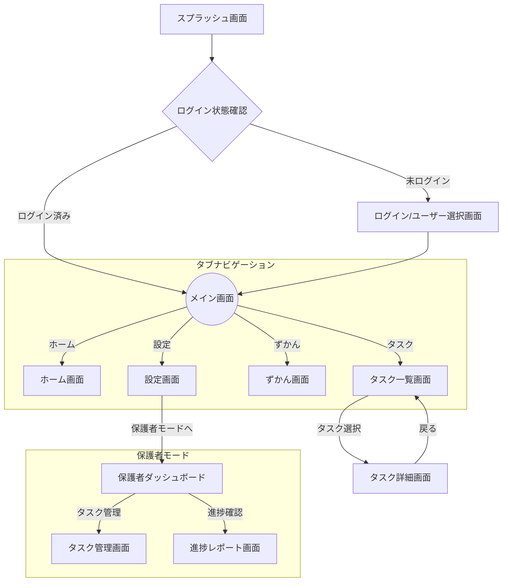

# 08 画面仕様書 - タスクしん発見！

## 1. はじめに

このドキュメントは、「タスクしん発見！」アプリの各画面の仕様と画面間の遷移について定義します。
アーキテクチャ設計書で定義されたフィーチャーと、この画面仕様を基にUI実装を進めます。

## 2. 主要画面リストと遷移図

### 2.1. 主要画面リスト

- **スプラッシュ/オンボーディング画面**
- **ログイン/ユーザー選択画面**
- **メイン画面 (タブUI)**
    - **ホーム画面** (`HomeFeature`)
    - **タスク一覧画面** (`TaskFeature`)
    - **ずかん画面** (`ShinFeature`) - ※MVP以降
    - **設定画面** (`SettingsFeature`)
- **タスク詳細画面** (`TaskFeature`の一部)
- **保護者向けダッシュボード** (`ParentFeature`) - ※MVP以降
- **タスク管理画面** (`ParentFeature`の一部) - ※MVP以降
- **進捗レポート画面** (`ParentFeature`の一部) - ※MVP以降

### 2.2. 画面遷移図

## 3. 各画面仕様詳細

### 3.1. 共通画面

---
**画面ID:** `SCR-001`
**画面名:** スプラッシュ画面
- **概要:** アプリ起動時に表示される。ブランドロゴやアプリアイコンを表示し、初期化処理を行う。
- **表示要素:**
    - アプリロゴ
    - アニメーション（任意）
- **アクション:**
    - 初期化処理完了後、自動的にログイン状態確認ロジックへ遷移する。
- **関連Feature:** - (アプリのルート)

---
**画面ID:** `SCR-002`
**画面名:** ログイン/ユーザー選択画面
- **概要:** ユーザーが未ログインの場合に表示される。アカウント作成、ログイン、または既存の子供プロファイルを選択する。
- **表示要素:**
    - ログインボタン
    - 新規登録ボタン
    - プロファイル選択リスト（複数ユーザーがいる場合）
- **アクション:**
    - ログイン成功後、メイン画面へ遷移する。
    - プロファイル選択後、メイン画面へ遷移する。
- **関連Feature:** `UserFeature`

---

### 3.2. 子供向け機能（メイン画面）

---
**画面ID:** `SCR-101`
**画面名:** ホーム画面
- **概要:** 子供がアプリを開いて最初に目にするメイン画面。その日のおすすめタスクや、「しん」からのメッセージなどを表示するダッシュボード。
- **表示要素:**
    - ユーザーアバターと名前
    - 「今日の〇〇しん」からのメッセージ
    - おすすめタスク（数件）
    - 最近達成したタスク
- **アクション:**
    - おすすめタスクをタップすると、タスク詳細画面(`SCR-202`)へ遷移する。
- **関連Feature:** `HomeFeature`

---
**画面ID:** `SCR-201`
**画面名:** タスク一覧画面
- **概要:** ユーザーに割り当てられた全てのタスクを一覧で表示する。
- **表示要素:**
    - タスクリスト
        - 各タスクのタイトル
        - 担当の「〇〇しん」アイコン
        - 期限
        - 状態（未完了、完了など）
    - タスクのフィルタリング/ソート機能（任意）
- **アクション:**
    - リスト内の特定のタスクをタップすると、タスク詳細画面(`SCR-202`)へ遷移する。
    - タスク完了ボタンをタップすると、タスクの状態が更新される。
- **関連Feature:** `TaskFeature`

---
**画面ID:** `SCR-202`
**画面名:** タスク詳細画面
- **概要:** 個々のタスクの詳細情報を表示し、タスクを実行するための画面。
- **表示要素:**
    - タスクのタイトル、詳細説明
    - 担当の「〇〇しん」のイラストと応援メッセージ
    - 期限、報酬（ポイントなど）
    - タスク完了ボタン
    - AIによるヒント提供ボタン
- **アクション:**
    - 「完了」ボタンを押すとタスクが完了し、一覧画面(`SCR-201`)に戻る。
    - 「ヒント」ボタンを押すと、AIからのヒントがポップアップ等で表示される。
- **関連Feature:** `TaskFeature` (Path)

---
**画面ID:** `SCR-301`
**画面名:** ずかん画面
- **概要:** これまでに出会った「〇〇しん」をコレクションとして閲覧できる。
- **表示要素:**
    - 「しん」のグリッドリスト
    - 各「しん」のサムネイル、名前
- **アクション:**
    - 「しん」をタップすると、しん詳細画面(`SCR-302`)へ遷移する。
- **関連Feature:** `ShinFeature`
- **備考:** MVP以降で実装予定。

---
**画面ID:** `SCR-302`
**画面名:** しん詳細画面
- **概要:** 「しん」一体一体の詳細情報や成長の記録を見る画面。
- **表示要素:**
    - 「しん」の大きなイラスト
    - 名前、説明、レベル
    - 関連するタスクの履歴
- **アクション:**
    - 「しん」とのインタラクション（タップで反応するなど）。
- **関連Feature:** `ShinFeature` (Path)
- **備考:** MVP以降で実装予定。

---
**画面ID:** `SCR-401`
**画面名:** 設定画面
- **概要:** アプリケーション全体の設定や、保護者向け機能への入り口を提供する。
- **表示要素:**
    - アカウント情報
    - 通知設定
    - サウンド設定
    - 「保護者モードに入る」ボタン
    - ログアウトボタン
- **アクション:**
    - 「保護者モードに入る」ボタンをタップすると、パスワード認証などを経て保護者向けダッシュボード(`SCR-501`)へ遷移する。
- **関連Feature:** `SettingsFeature`

---

### 3.3. 保護者向け機能

---
**画面ID:** `SCR-501`
**画面名:** 保護者向けダッシュボード
- **概要:** 保護者が子供の利用状況を確認し、各種管理機能へアクセスするためのトップ画面。
- **表示要素:**
    - 子供のプロファイルサマリー
    - 最近の活動レポートへのリンク
    - 「タスクを管理する」ボタン
    - 「進捗レポートを見る」ボタン
    - ペアレンタルコントロール設定へのリンク
- **アクション:**
    - 「タスクを管理する」をタップすると、タスク管理画面(`SCR-502`)へ遷移する。
- **関連Feature:** `ParentFeature`
- **備考:** MVP以降で実装予定。

---
**画面ID:** `SCR-502`
**画面名:** タスク管理画面
- **概要:** 保護者が子供のタスクを作成、編集、削除するための画面。
- **表示要素:**
    - タスク一覧
    - 新規タスク作成ボタン
    - タスクテンプレート選択機能
- **アクション:**
    - タスクを作成・編集・削除する。
- **関連Feature:** `ParentFeature`
- **備考:** MVP以降で実装予定。 
